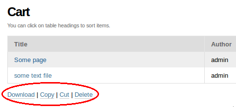

=============
slc.cart
=============

:Framework: `Plone 4.2 <http://plone.org>`_
:Bug tracker: https://github.com/syslabcom/slc.cart/issues
:Source: https://github.com/syslabcom/slc.cart
:Documentation:
:Code status:

    .. image:: http://travis-ci.org/niteoweb/slc.cart.png
       :align: left
       :target: http://travis-ci.org/niteoweb/slc.cart

.. topic:: Summary

    A module for batch processing the objects in Plone site. Objects can be
    added to cart and then various batch actions can be perfomed on them with
    a single click, such as download, delete and copy.

Installation
============

To install ``slc.cart`` ... TODO:

Basic usage
===========

After successful installation two changes immediately become visible:

* In site's ``portal_actions`` menu a link to Cart becomes available. This
  link also displays the current number of items in cart (in parentheses).

  .. image:: docs/images/portal_actions.png

* ``Add to Cart`` / ``Remove from Cart`` link appears in document byline of
  the objects, for which the link is applicable.

  .. image:: docs/images/document_byline.png

The link in ``portal_actions`` points to a new ``@@cart view``, which lists
the curent cart contents and provides links to various actions that can be
performed in batch on the items in cart.

List of Actions
---------------

``Copy``
  TODO: describe

``Cut``
  TODO: describe .. similar to copy

``Download``
  TODO: describe ... and only "downloadable" stuff gets downloaded

``Delete``
  TODO: describe

``Clear Cart``
  TODO: describe .. removes all items from cart without affecting them

Known Issues and TODOs
======================

* Localization support
* Testing in a production environment
